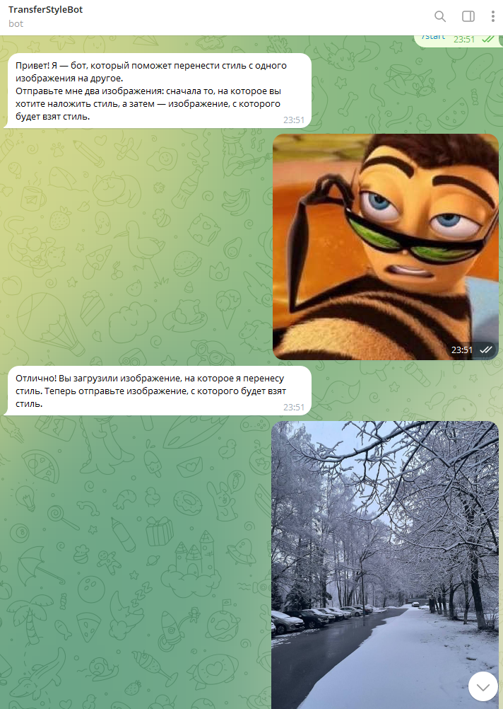
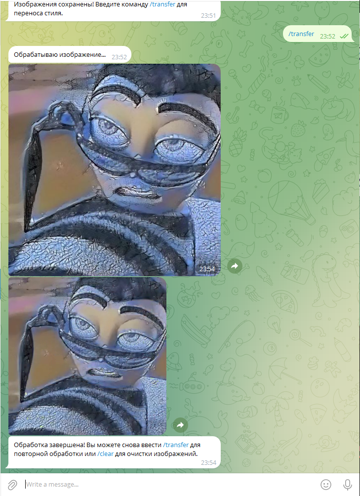
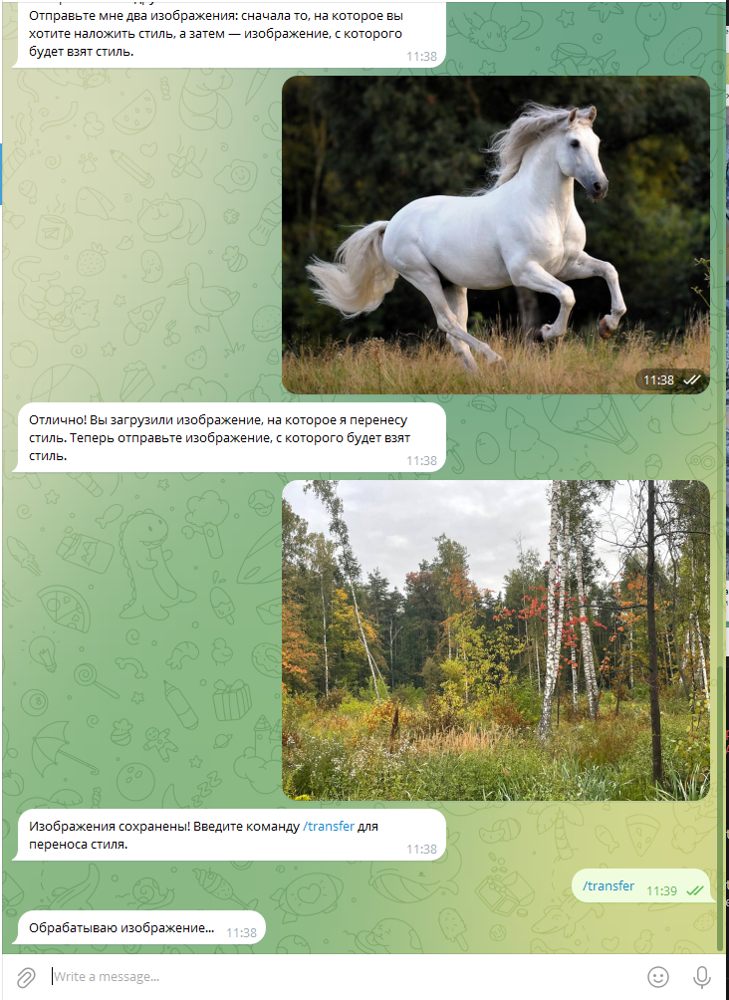
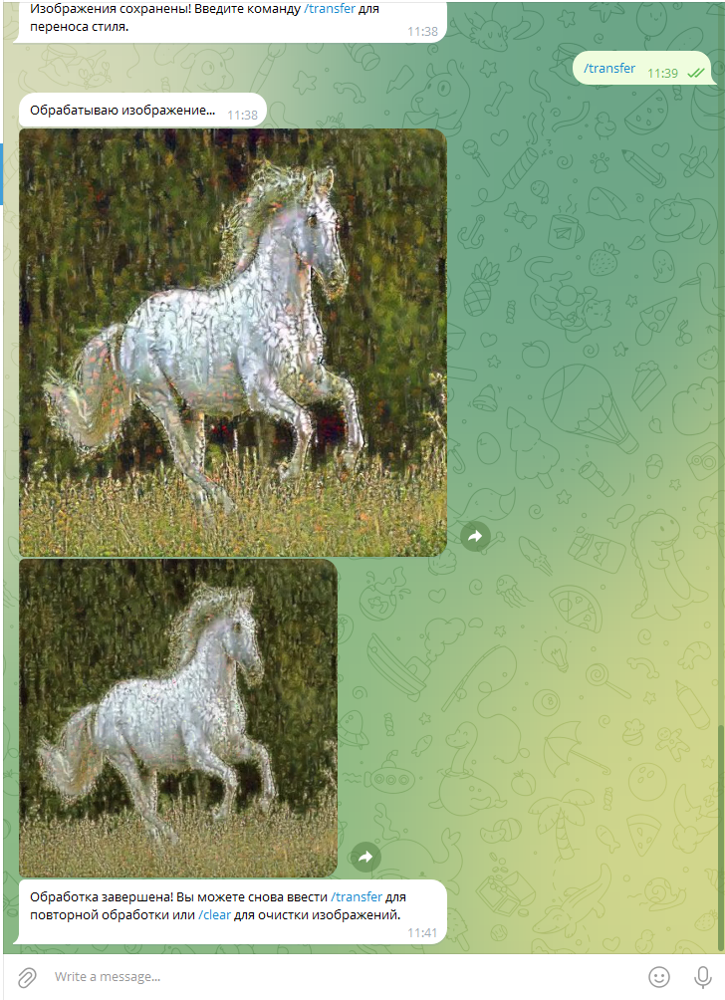

# dls_final_project

@dls_project_style_transfer_bot

## Доступные команды
    /start - начать работу
    /help - краткая сводка о боте
    /transfer - перейти к обработке после сохранения картинок
    /clear - очистить историю картинок

## Запуск проекта
В рабочей директории
docker-compose up  

## Использование
1. Отправьте команду `/start`, чтобы начать работу с ботом.
2. Бот попросит вас отправить два изображения:
    - Первое изображение — это "контент" (например, ваше изображение, к которому вы хотите применить стиль).
    - Второе изображение — это "стиль" (например, изображение, чей стиль вы хотите перенести).
3. Бот применит стиль к контенту и отправит вам результат.
4. Бот также может отправить промежуточные изображения, показывающие процесс обучения модели.

## Примечание
- Бот использует модель **Neural Style Transfer**, которая применяет стиль одного изображения (например, картины художника) к другому изображению (например, фотографии).
- Для работы модели требуется наличие **GPU**. Вы можете протестировать модель в **Google Colab** с использованием GPU.
- Изображения сохраняются в локальной папке images

## Дополнительные материалы

- **Google Colab Notebook:** Для более детального изучения и тестирования модели, вы можете использовать Google Colab Notebook, доступный по адресу: [src/notebook/neural_style_transfer.ipynb](src/notebook/neural_style_transfer.ipynb).

## Демо
Google Disk - https://drive.google.com/file/d/1I1FZaNy0j19c44IckE-qDjf2f8XJFpjC/view?usp=sharing  
Yandex Disk - https://disk.yandex.ru/i/t8QUQHH7tzRmwA

## Примеры

